# Stipple

A cross-platform UI library and toolkit in Rust.

Stipple draws **beautiful, fully themeable, pixel-identical** interfaces on Linux,
macOS, Windows, Android, iOS, and the web — staying **as close to the OS as
possible** while depending on **as little third-party code as possible**.

It builds on the pure-Rust [`oxideav`](https://github.com/OxideAV) media stack
for all 2D content rendering (scene graph, CPU rasterizer, font shaping, image
decode, SVG) and adds everything around it: native windowing and input per OS,
presenting the rendered buffer, and a declarative, reactive UI toolkit.

```rust
use stipple::prelude::*;

struct Counter { n: i64 }

fn view(state: &Counter, cx: &mut Cx<Counter>) -> Element {
    let theme = *cx.theme();
    column(vec![
        heading(&theme, format!("{}", state.n)),
        row(vec![
            button_labeled(&theme, "−").on_tap(cx, |s: &mut Counter| s.n -= 1),
            button_labeled(&theme, "+").on_tap(cx, |s: &mut Counter| s.n += 1),
        ])
        .gap(8.0),
    ])
    .gap(12.0)
    .padding(Insets::uniform(24.0))
}

fn main() {
    let mut app = App::new(Counter { n: 0 }, view)
        .title("Counter")
        .theme(Theme::dark());
    if let Some(font) = Font::system_default() {
        app = app.font(font);
    }
    app.run();
}
```

> **Status: pre-alpha.** The architecture and phased plan live in
> [`ROADMAP.md`](./ROADMAP.md). APIs are unstable.

The same app, rendered by Stipple's **native backends** and screenshotted in CI
(the `Visual` workflow) — Linux X11 (under Xvfb) and Wayland (under headless
sway), Win32, and Cocoa, each from-scratch with no windowing crates:

| Linux / X11 | Linux / Wayland | Windows / Win32 | macOS / Cocoa |
|---|---|---|---|
| 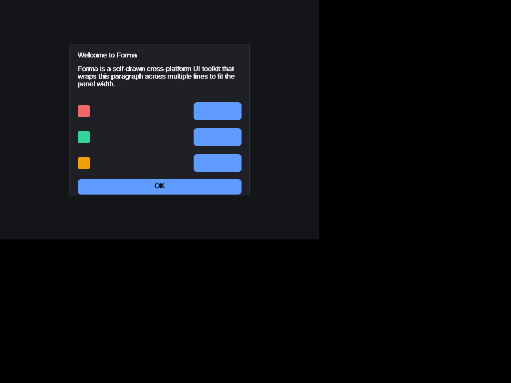 | 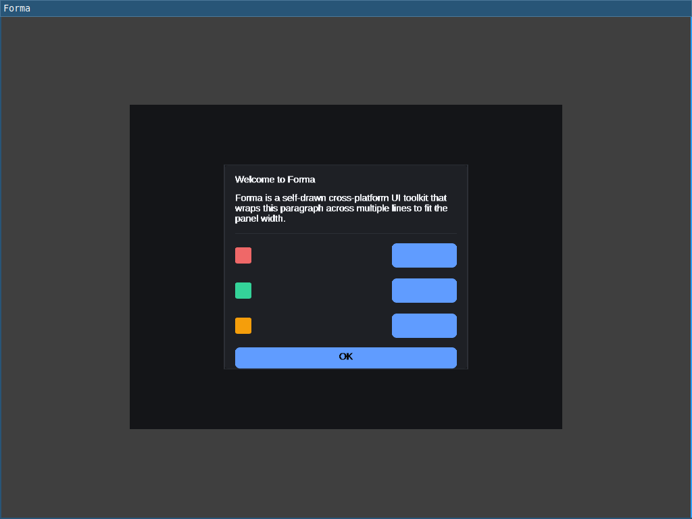 | 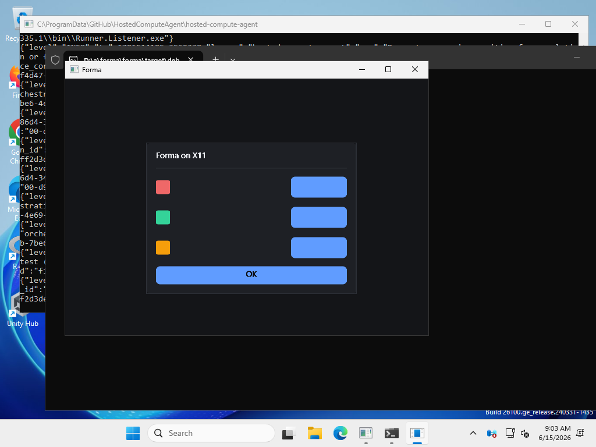 | 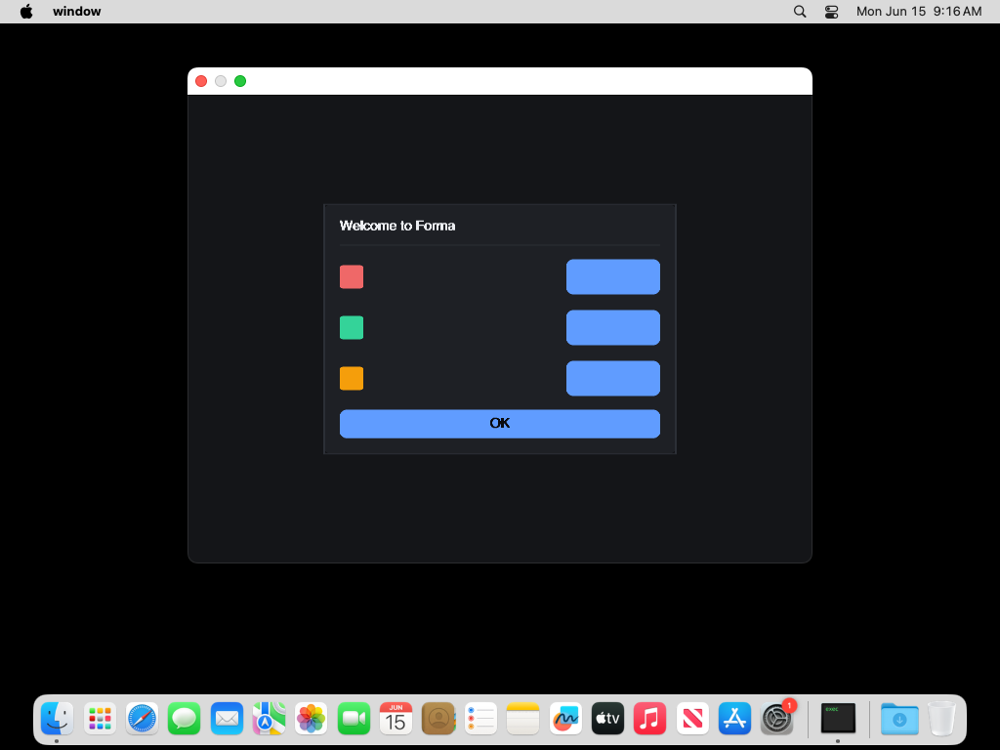 |

| Web / wasm + canvas | GPU / GLES (offscreen) |
|---|---|
| 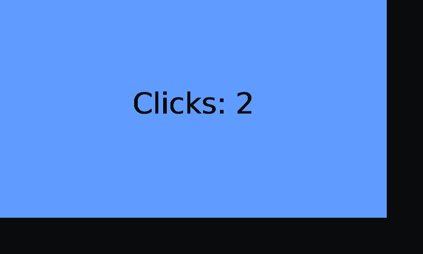 | 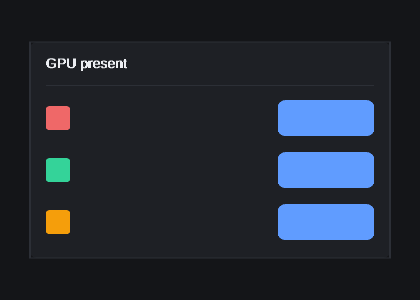 |

Input is verified too: CI synthesizes real events and screenshots the result —
X11 via `xdotool` (clicking a counter; caret-aware editing — type "Stipple",
arrow-left twice, insert "XY" → "StippXYle" with a mid-string caret), macOS via
`cliclick`, and **Wayland** via `wtype` (whose virtual keyboard exercises the
`wl_seat` keyboard + xkb-keymap decode path — Tab to focus, then type "stipple
wl"):

| X11 click | X11 edit (mid-string caret) | macOS click | Wayland type |
|---|---|---|---|
| 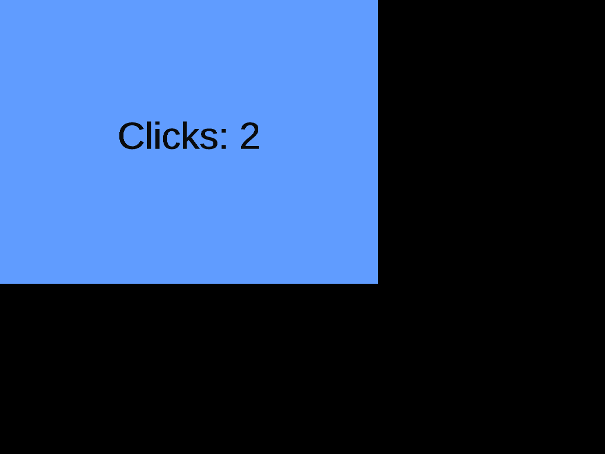 | 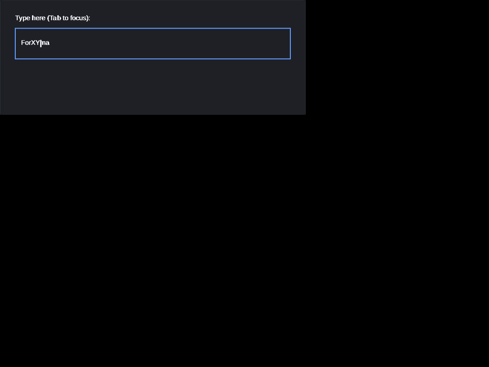 | 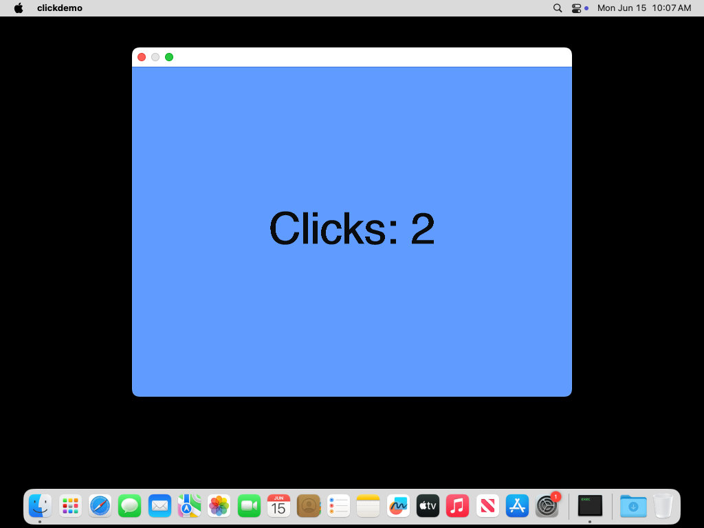 | 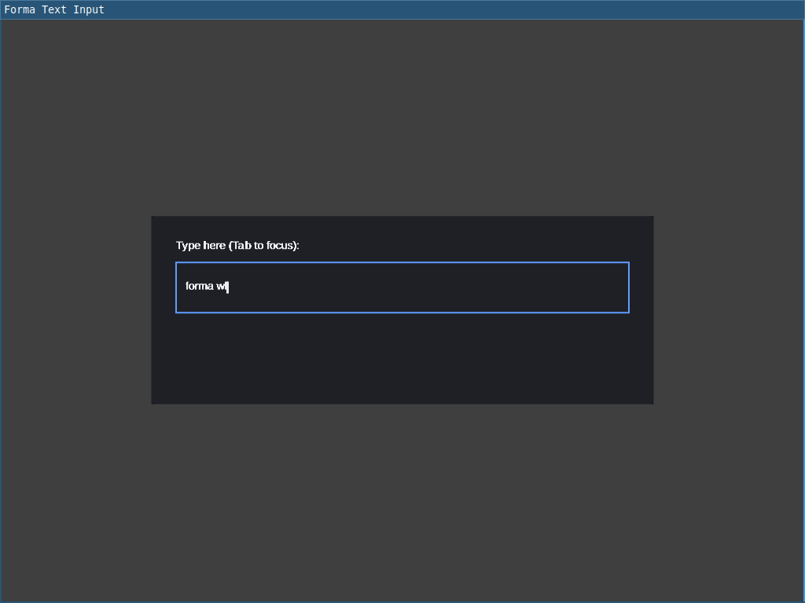 |

## Themeable by design

Every widget reads its colors and metrics from a [`Theme`] — a semantic
`Palette` (roles, interaction states, status colors, overlays), a `Typography`
scale, a `Spacing` scale, and a corner radius. Customizing is a one-liner:
`Theme::dark().with_accent(color).with_radius(14.0)` recolors the accent,
derives its hover/active tints, and picks a readable on-color automatically;
`high_contrast()` maximizes text/border contrast. **Material 3** is built in
too: `Theme::material3_light()` / `material3_dark()`, or
`Theme::material3_from_seed(color, dark)` for Material You dynamic color from
any seed. The same card below is rendered under four themes (light, dark, a
violet-accent dark, high-contrast), montaged in CI:

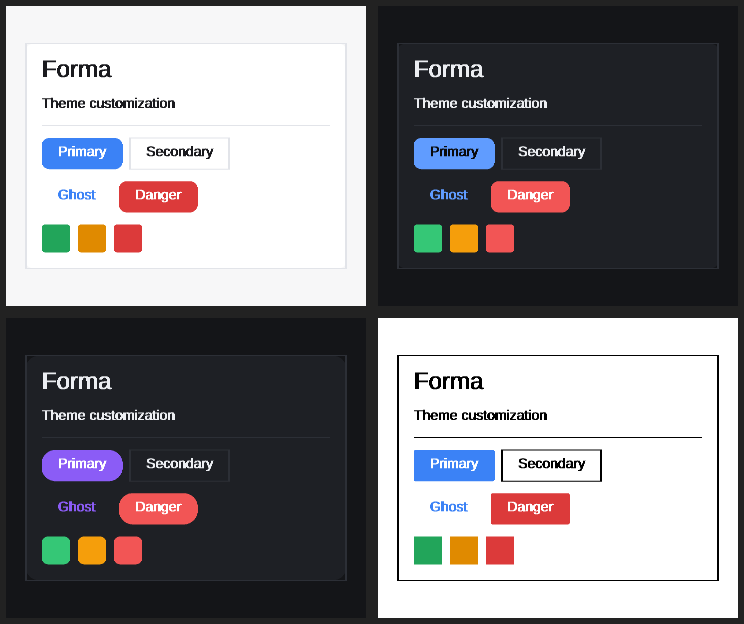

## Design at a glance

- **Software-first rendering**, with a GPU path: raw, hand-written GLES2
  (SDF boxes + glyph atlas, usable for live windows via `App::render_with`),
  Vulkan, Metal, Direct3D 11, and WebGPU backends. No wgpu.
- **Reactive / declarative** API: UI is a function of state. Frames are
  damage-diffed and only changed regions are re-rasterized and presented.
- **Self-drawn widgets**: one theme engine, identical on every platform.
- **Accessible**: the semantic tree is exposed to AT-SPI (Linux),
  NSAccessibility (macOS) and UI Automation (Windows), each over a hand-written
  bridge (D-Bus wire protocol, `objc_msgSend`, COM vtables).
- **No** `winit` / `wgpu` / `taffy` / `lyon` / GTK / Qt / `zbus` / `windows` /
  `objc`. OS interfaces are hand-written per platform in `stipple-platform`.

## Workspace layout

| Crate | Role |
|---|---|
| `stipple-geometry` | Logical-pixel math (Point, Size, Rect, Insets, Affine) |
| `stipple-render` | Scene → oxideav `VectorFrame` → raster → `Surface`; fonts |
| `stipple-platform` | Per-OS windowing, input, clipboard, file dialogs, accessibility bridges, shared memory + sandbox |
| `stipple-layout` | Flex/box layout solver |
| `stipple-core` | Reactive runtime: `View`, `Element` IR, reconcile, events, a11y tree |
| `stipple-anim` | Easing, tweens, springs |
| `stipple-style` | Design tokens and themes (incl. Material 3) |
| `stipple-widgets` | Standard widget library |
| `stipple-gpu` | Raw GPU backends (GLES2, Vulkan, Metal, D3D11), feature-gated; dma-buf / shared-texture export |
| `stipple-web` | wasm32 target: renders into a framebuffer a `<canvas>` blits (no wasm-bindgen) |
| `stipple` | Umbrella crate: `App`, prelude, re-exports |

Widgets available in the prelude: `panel`, `row`, `column`, `spacer`,
`divider`, `label`, `heading`, `paragraph`, `button`, `button_labeled`,
`button_variant`, `text_field`, `text_editor`, `text_area`, `checkbox`,
`radio`, `switch`, `slider`, `progress_bar`, `spinner`, `swatch`,
`setting_row`, `tabs`, `scroll`, `menu` / `menu_item` / `open_menu`,
`open_dialog`, `tooltip`, and `viewport` (embedded external content).

## Examples

```sh
cargo run -p window        # a settings panel in a native window
cargo run -p clickdemo     # a click-counting button
cargo run -p calculator    # a four-function calculator
cargo run -p textinput     # an editable text field (Tab to focus, then type)
cargo run -p textarea      # multi-line editing and selection
cargo run -p clipboarddemo # copy / cut / paste
cargo run -p scrolldemo    # a clipped, wheel-scrolled list
cargo run -p overlaydemo   # dropdown menu + modal dialog
cargo run -p tabsdemo      # tabs + right-click context menu
cargo run -p hoverdemo     # hover highlighting
cargo run -p multiwindow   # two OS windows sharing one state
cargo run -p filedialog    # native file dialog (XDG portal on Linux)
cargo run -p themegallery  # one card under four themes (writes .raw files)
cargo run -p material3demo # Material 3 baseline + dynamic-color themes
```

Each opens a real native window via `App::run` (Wayland, then X11, on Linux;
Win32; Cocoa), or falls back to a one-shot headless render where no display is
available. Platform and subsystem probes live alongside them:
`gpuwindow` / `gpudemo` (GLES, `--features stipple-gpu/gl`), `d3ddemo`,
`metaldemo`, `dmabuftest`, `dri3probe`, `viewportdemo`, `contentproc`
(sandboxed content process composited over shared memory), `a11ydemo` and
`uiademo` (accessibility bridges), and `androiddemo` (a `NativeActivity`
cdylib). The web target lives in `crates/stipple-web` (built for `wasm32`; see
the `Visual` workflow).

## Status & MSRV

Pre-alpha. The whole workspace builds on **Rust 1.88** (edition 2024).

Working today, each verified in CI on its platform:

- The reactive toolkit: layout, state, tap / keyboard / focus / drag / hover /
  scroll / context menus, caret-aware multi-line text editing with selection,
  word wrapping, clipboard, overlays, multi-window, and the widgets above.
- Native backends: **X11** (with MIT-SHM present), **Wayland**, **Win32**,
  **Cocoa**, plus **web** (wasm + canvas), an **iOS UIKit** backend (run on the
  simulator), and an **Android** `ANativeWindow` present path (run on the
  emulator).
- **GPU**: GLES2 scene rendering in a live window, and off-screen Vulkan,
  Metal, D3D11 and WebGPU pipelines.
- **Accessibility**: the full element tree on all three desktops.
- **Compositor seams** for embedding a sandboxed content process (e.g. a
  browser engine): viewports, shared-memory and dma-buf / IOSurface / D3D
  shared-handle buffer transport, input forwarding, seccomp sandboxing, and
  DRI3 + Present on-window GPU present.

Next up (see `ROADMAP.md`): mobile touch input and full lifecycle, zero-copy
GPU swapchain present, accessibility change events, and broader toolkit depth.

## License

MIT

